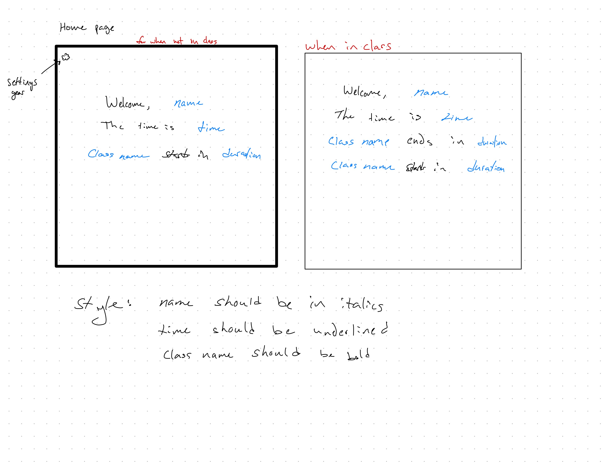
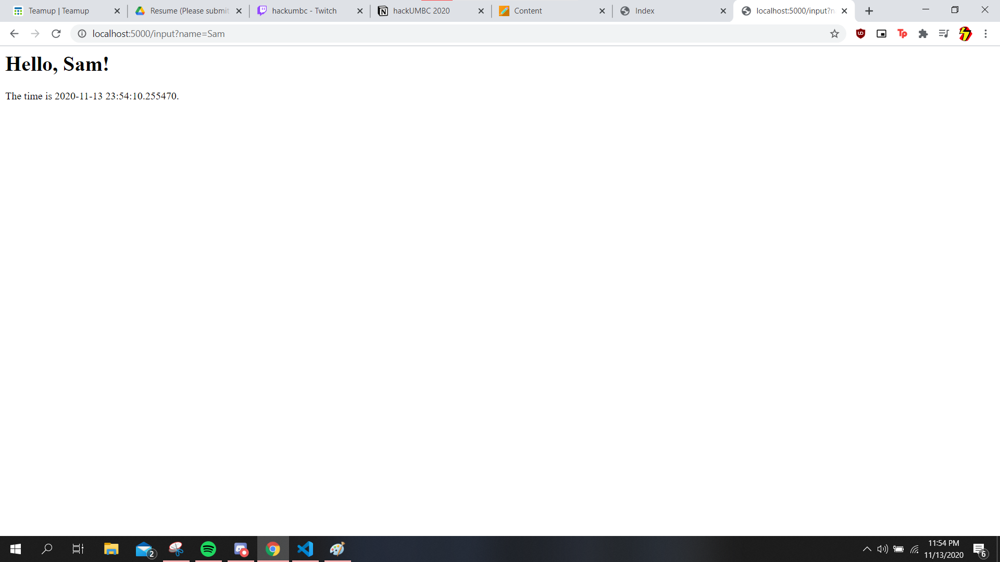

# Better Class Calendar
## To-Do
- [ x ] lay out HTML skeleton
- [ x ] link the forms to a database
- [ ] style the HTML skeleton
- [ ] dynamically update the HTML using Flask
    - [ ] math for showing the nearest class (future)

## Required Functions
* adding classes
* show the proper class and link at the corrct time
* compare times to current time
* edit a json file that stores the classes and name of the user
* update on start of program
    * maybe update every 15 minutes

## Optional Functions
* log in
* have a friendly link
* display weather

## Notes
Skeleton of the web app

Basic functions

Figuring out how to accept user input
